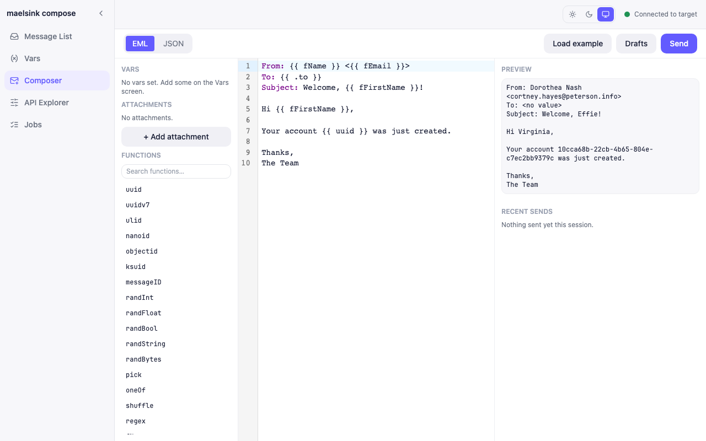

`maelsink compose` starts a standalone browser-based playground (`cmd/compose.go`) that gives every capability of `maelsink shell` a point-and-click front end, without a terminal. Its Composer screen (`web-compose/src/screens/ComposerScreen.tsx`) is the visual equivalent of the shell's `send` builtin.

```
maelsink compose --api-addr http://127.0.0.1:9090 --smtp-addr 127.0.0.1:1025 --open
```

## The Composer workflow

1. **Pick a mode** — EML or JSON, mirroring the shell send builtin's `--eml`/`--json`/flag-based body sources. The editor pane (a CodeMirror instance) switches its syntax highlighting accordingly.
2. **Write or load a template** — a built-in example-template menu seeds the editor with a starting EML or JSON message; a Vars panel supplies the `{{ }}` template variables referenced in the content.
3. **Attach files** (EML mode only) — an attachments list lets you add/remove `{path, filename}` entries, matching `send --attach`'s shape; JSON mode instead carries attachments inline in the message spec text itself.
4. **Live preview** — as you type, the screen debounces (400ms) and calls the render endpoint, showing the fully rendered rendered/raw output and any template render error (with line/column, when available) without sending anything.
5. **Send** — the Send button posts the rendered template to the target's SMTP port and records the result (recipients, success/failure) in a "recent sends" list kept for the session.
6. **Save/load drafts** — named drafts (format, content, attachments) persist across reloads so a work-in-progress template survives a page refresh.

## Relationship to `maelsink shell`

The Composer is a pure client of the same target maelsink instance's SMTP port and REST API that `maelsink shell`/`maelsink send` talk to — it starts no database of its own. Anything you compose and send here shows up in that target's inbox exactly like a message sent from the CLI or a real app.


