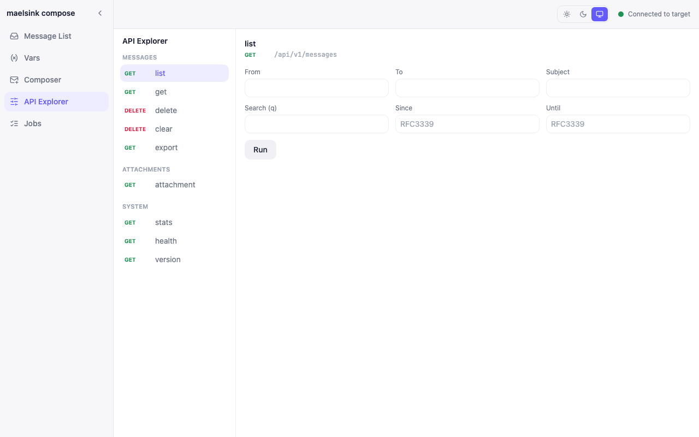
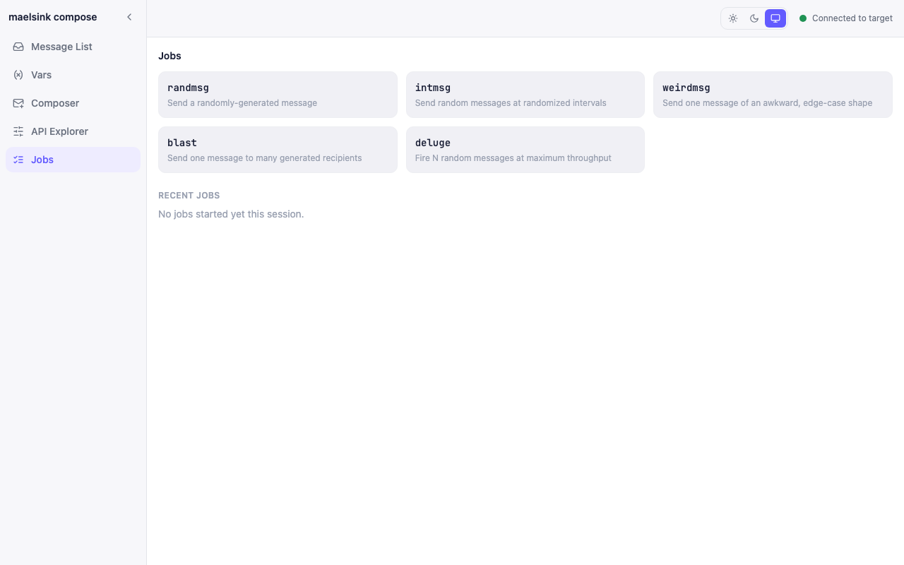

`maelsink compose` starts a standalone, browser-based playground giving every capability of `maelsink shell` a point-and-click front end. It's a pure client of a target maelsink instance's REST API and SMTP port (`internal/compose`) — it starts no database of its own and never imports `internal/store`/`internal/smtp`/`internal/api`/`internal/webui` directly.

```
maelsink compose --api-addr http://127.0.0.1:9090 --smtp-addr 127.0.0.1:1025 --open
```

| Flag | Purpose |
|---|---|
| `-L, --listen` | Compose server listen address (default `:8090`) |
| `-A, --api-addr` | Target maelsink REST API base URL |
| `-u, --api-user` / `-P, --api-pass` | Basic-auth credentials for the target API, if fronted by auth |
| `-k, --api-insecure-skip-verify` | Skip TLS verification when calling the target API |
| `-C, --api-ca-cert` | CA cert to trust for the target API's TLS |
| `-S, --smtp-addr` | Target maelsink SMTP address |
| `-U, --smtp-user` / `-W, --smtp-pass` | Target SMTP AUTH credentials |
| `-o, --open` | Auto-open the compose UI in a browser on startup |

The app has three main screens (plus a message list/detail pair and a Vars screen), all under `web-compose/src/screens/`.

## Composer screen

Covered in depth in [Sending Mail via Composer UI](/maelsink/docs/usage/sending-mail/via-composer-ui/) — the visual equivalent of the shell's `send` builtin: EML/JSON mode toggle, a CodeMirror editor with an example-template menu, an attachments list (EML mode), a debounced live preview (render endpoint, 400ms), a Send action with a recent-sends log, and named drafts.

## API Explorer screen

`ApiExplorerScreen.tsx` is a curated, Postman-style two-pane explorer — a left nav of every REST endpoint (grouped: Messages, Attachments, System) with a method badge, and a right pane showing only the selected endpoint's param form plus the **raw outgoing request and raw response**, as JSON. It's deliberately not a generic method/path/body builder — each endpoint gets its own purpose-built form:

| Group | Endpoints |
|---|---|
| Messages | `list` (`GET /api/v1/messages`), `get` (`GET .../:id`), `delete` (`DELETE .../:id`), `clear` (`DELETE /api/v1/messages?confirm=true`), `export` (`GET /api/v1/messages/export`) |
| Attachments | `attachment` (`GET .../:id/attachments/:attachmentId`) |
| System | `stats`, `health`, `version` |

Endpoints with no parameters (`stats`, `health`, `version`, `clear`) render as a simple "Run" button; parameter-heavy ones (`list`, `export`) get a full filter form matching the CLI's own flags. Every call shows both the request that was made and the response body (or error) exactly as received — useful for understanding the API surface without reaching for `curl`.

## Jobs Panel screen

`JobsPanelScreen.tsx` gives one button per traffic-generating command — the same five builtins covered in [Sending Mail via Shell](/maelsink/docs/usage/sending-mail/via-shell/):

| Kind | Description (as shown in the UI) |
|---|---|
| `randmsg` | Send a randomly-generated message |
| `intmsg` | Send random messages at randomized intervals |
| `weirdmsg` | Send one message of an awkward, edge-case shape |
| `blast` | Send one message to many generated recipients |
| `deluge` | Fire N random messages at maximum throughput |

Clicking a kind opens a modal with that command's parameters — a shared content form (To/From/Subject/Body mode/Scenario/Attachment count) plus kind-specific fields like Count for `randmsg`. Starting a job opens a WebSocket progress stream; a jobs table lists kind, status (`running`/`completed`/`cancelled`/`failed`, color-coded), sent/failed counts, elapsed time, and start time, with a Cancel action for any still-`running` job. Completed and cancelled jobs stay listed for the life of the compose process (in-memory only — nothing is written to `localStorage`), so you can review what a burst of test traffic actually did after the fact.

## Relationship to the target instance

None of these three screens store anything themselves. Every action — composing, exploring, or firing off a job — is a direct SMTP send or REST call against whatever target instance `--api-addr`/`--smtp-addr` point at, so anything you do here shows up in that target's real inbox exactly as if it came from `maelsink shell` or a real application.



